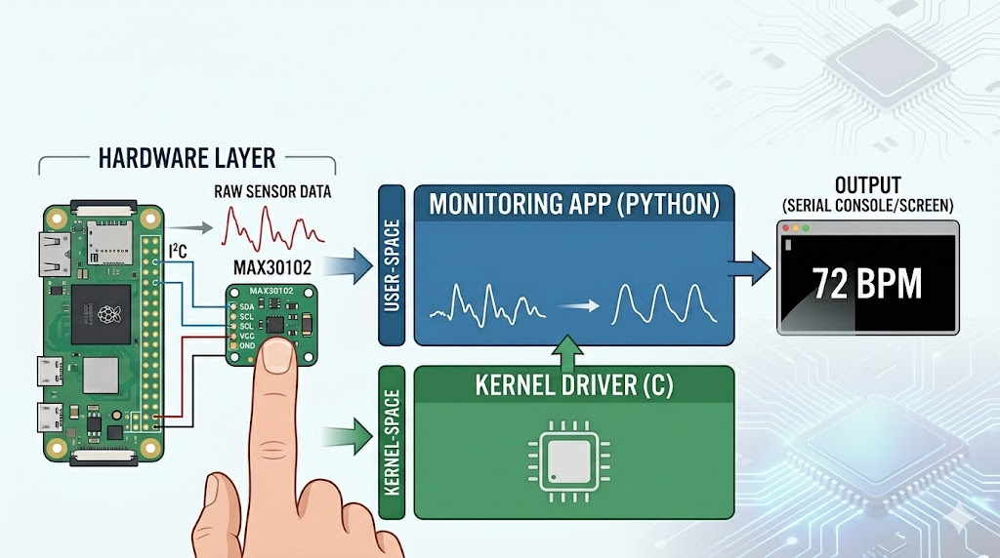

# 🩺 Yocto Medical: MAX30102 Heart Rate Monitoring System

This project provides a custom Embedded Linux distribution built using the [**Yocto Project**](https://www.yoctoproject.org/), specifically designed for the **Raspberry Pi Zero 2 W** to interface with the **MAX30102** heart rate and SpO2 sensor. It features a complete, integrated software stack:
* **Kernel-space**: A custom I2C character driver written in C for reliable, low-latency communication with the sensor hardware.
* **User-space**: A pre-installed Python monitoring application reads data from the driver and utilizes digital signal processing algorithms to filter noise and calculate an accurate BPM (Beats Per Minute) in real-time.

---


### Prerequisites (Host Machine)

Before starting the build process, your host machine (recommended Ubuntu 22.04 LTS or 24.04 LTS) must have the following essential packages installed.

#### Install Dependencies:

```
sudo apt-get install build-essential chrpath cpio debianutils diffstat file gawk gcc git iputils-ping libacl1 locales python3 python3-git python3-jinja2 python3-pexpect python3-pip python3-subunit socat texinfo unzip wget xz-utils zstd liblz4-tool
```

#### System Requirements:

* Disk Space: At least 100GB of free space.
* RAM: Minimum 8GB (16GB recommended).
* CPU: Multiple cores are highly recommended to reduce compilation time.

### Custom Layer Structure (meta-heartrate)

This layer contains the metadata and recipes required to build the kernel driver and the test application:
```
meta-heartrate/
├── conf/
│   └── layer.conf          # Layer configuration and priority
├── recipes-kernel/
│   └── max30102-mod/
│       ├── files/
│       │   ├── max30102-med.c # Driver source code (C) - Kernel Space
│       │   └── Makefile       # Standard Kbuild Makefile
│       └── max30102-mod.bb    # Bitbake recipe for the Kernel Module
└── recipes-example/
    └── example/
        └── example_0.1.bb     # User-space example application recipe
```

### Build Instructions

#### 1. Initialize the build environment:

```
source poky/oe-init-build-env build-rpi
```

#### 2. Initialize the build environment:

```
bitbake core-image-minimal
```
Once the build completes, the flashable image file will be located at: ```tmp/deploy/images/raspberrypi0-2w-64/core-image-minimal-raspberrypi0-2w-64.rootfs.wic.bz2```

### Running the Monitoring Application

#### 1. Access via Serial Console:

Connect a USB-to-TTL adapter to Pin 8 (TX) and Pin 10 (RX) of the Pi. Open your terminal and run:
```
sudo screen /dev/ttyUSB0 115200
```

#### 2. Login

Once the boot process completes, the system will prompt for a login:
* User: ```root```
* Password: (None - just press Enter)

#### 3. System Verification:

```
# Check if the kernel driver is loaded
lsmod | grep max30102

# Confirm the device node exists
ls -l /dev/max30102

# Check I2C bus (Sensor should appear at address 0x57)
i2cdetect -y 1
```

#### 4. Run the Monitor:

Since the application is pre-installed in the system path ```/usr/bin/```, you can launch it from any directory by simply typing:
```
heartrate_monitor
```
The application will provide real-time feedback directly in your terminal.
 * **No Finger**: It will display ```Status: No finger detected```.
 * **Measurement**: Once you place your finger on the sensor, the **RED** and **IR** values will update at 10Hz.
 * **BPM calculation**: After approximately 10 seconds (once the data buffer is full), the **BPM** value will appear and stabilize.
 * To stop the application and return to the command prompt, press ```Ctrl + C```.
